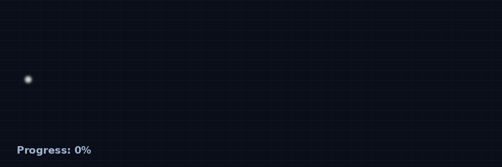
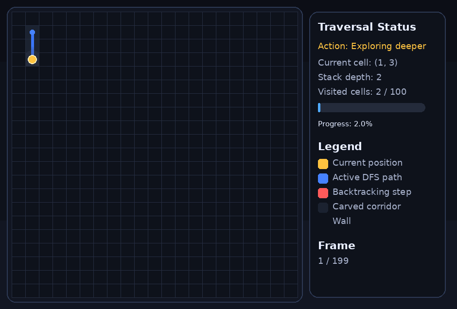
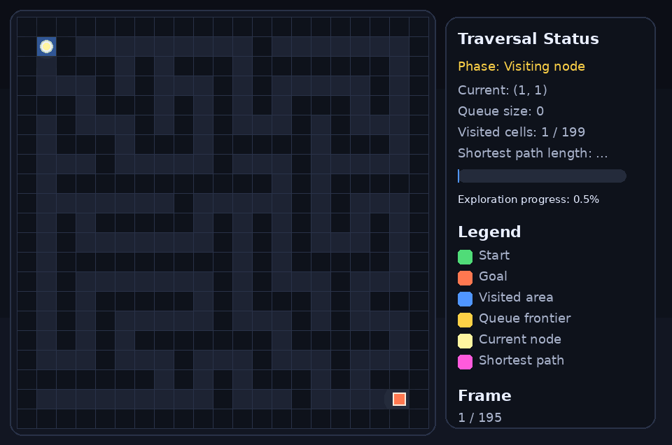
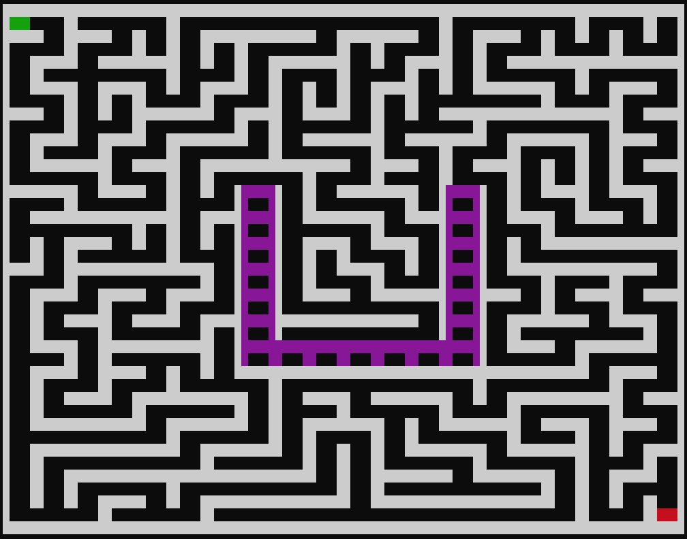
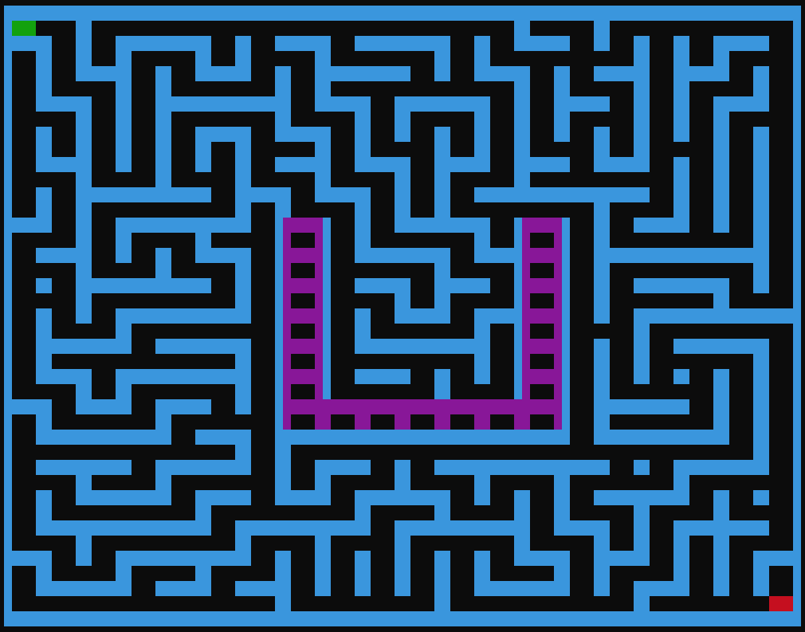
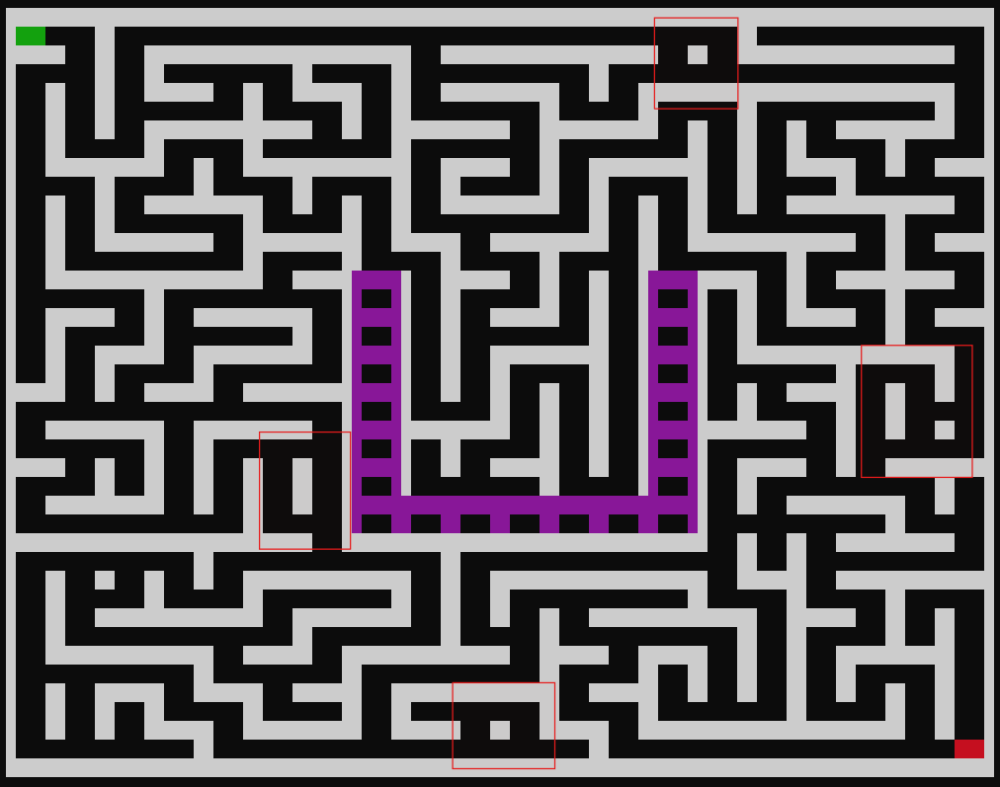

<p align="center">
  
</p>


<div align="center">

## 🔍 Depth-First Search (DFS)

</div>

<p align="center">
  
</p>

<p align="center">
  <span style="background: linear-gradient(90deg, red, cyan); 
               -webkit-background-clip: text; 
               color: transparent;">
    The animation demonstrates how DFS dives deep into paths and backtracks when necessary.
  </span>
</p>


<br>
<p align="center">
  
</p>
<br>

This project is a Python-based maze generation and visualization system that demonstrates how graph traversal algorithms work in practice, especially Depth-First Search (DFS). The application generates a dynamic maze structure using recursive backtracking techniques, manages cell states and wall connections, and visually renders the final maze layout.

### ✨ Features

- 🧩 Maze generation using DFS traversal
- 📦 Matrix and cell-based architecture
- 🎨 Visual maze rendering system
- 🧠 Recursive algorithm visualization
- ⚙️ Config-driven customization
- 🚪 Entry and exit point support
- 🔄 Loop generation and path tracing
- 📍 Coordinate and direction management
- 🛡️ Strong input parsing and validation

### 🏗️ Project Structure

- `add_loops.py` → imperfect maze generation enhancements
- `cell.py` → maze cell representation
- `cell_closed.py` → predefined blocked cell patterns
- `config.txt` → maze configuration settings
- `dfs.py` → DFS-based maze generation algorithm
- `draw_maze.py` → maze visualization and rendering
- `generate_matrix.py` → matrix/grid creation
- `get_block_position.py` → blocked area positioning utilities
- `get_direction.py` → movement direction logic
- `main.py` → project entry point and interactive menu system
- `parsing.py` → configuration parsing and validation
- `trace_u.py` → special path/block tracing logic

## 🤝 Team Contribution — Achraf Elhadjaoui

*Achraf Elhadjaoui* contributed to the BFS-based path processing part of the project. His work focuses on finding a valid path through the generated maze using Breadth-First Search and extracting useful path-related information for visualization and analysis.


- `path`
- `valid path coordinates`
- `wall values`
- `path directions` 


### 🎯 Purpose


The goal of this project is to understand:

- 🧠 DFS & BFS algorithms
- 🧩 Maze generation and solving
- 🌐 Graph traversal concepts
- 🎨 Algorithm visualization


## 🚀 How to Run

### 1️⃣ Clone the repository

```bash
git clone https://github.com/Oualidelaz/maze-generation.git
cd maze-generation/src
```

---

### 2️⃣ Configure the maze settings

Edit the `config.txt` file:

```text
HEIGHT = 20
WIDTH = 20
ENTRY = 0,0
EXIT = 19,19
PERFECT = TRUE
```

#### Configuration Options

- `HEIGHT` → Maze height
- `WIDTH` → Maze width
- `ENTRY` → Starting cell `(x,y)`
- `EXIT` → Exit cell `(x,y)`
- `PERFECT` → Enable or disable additional loops

---

### 3️⃣ Run the program

```bash
python main.py config.txt
```

---

### 4️⃣ Use the interactive menu

```text
==============================
         MAZE MENU
==============================

[1] Draw Maze
[2] Change Maze Color
[3] Show Maze Path

[0] Exit

==============================
```

- **Draw Maze** → Generate and display a maze
- **Change Maze Color** → Render the maze using a different color theme
- **Show Maze Path** → Display the solution path *(coming soon)*
- **Exit** → Close the application

---

### 📌 Requirements

- Python 3.8+
- A terminal that supports ANSI colors


<div align="center">

## 📌 Short Description - DFS

</div>

**Depth-First Search (DFS)** is an algorithm used to explore structures like graphs or grids.

- It starts at one point and follows a path as far as it can. When it reaches a dead end, it uses a process called backtracking to return to the last point where another path is available, and then continues exploring from there.
- Backtracking means going back to a previous point to try a different path.
- This process repeats until all nodes (or cells) have been visited.

It is widely used in:
- Graph traversal
- Maze generation 🧩
- Tree exploration 🌲
- Backtracking problems 🔁


<div align="center">

## ⚙️ Functions and Responsibilities

</div>

<table>
  <tr>
    <td width="180"><strong>🧠 <code>dfs()</code></strong></td>
    <td>
      <strong>Core traversal algorithm</strong><br>
      Explores one path as deeply as possible before backtracking to continue with other branches.
    </td>
  </tr>
</table>


<div align="center">

<h2>⚙️ Core <span style="color: #FFD700;">DFS</span> Function</h2>

</div>


<br>

<div style="border-left: 4px solid cyan; padding: 12px; background:rgba(30, 30, 30, 0.45); color: #ddd;">

<strong style="color: white;">📌 Grid Initialization</strong>

<ul>
<li>Create a 2D grid of <code>Cell</code> objects (matrix)</li>
<li>Each cell is represented as: <code>Cell(row, col)</code></li>
</ul>

<strong>Example:</strong>
<ul>
<li><code>WIDTH = 5</code>, <code>HEIGHT = 5</code></li>
<li>Cells range from <code>Cell(0,0)</code> → <code>Cell(4,4)</code></li>
</ul>
</div>
<br>


```python
class Cell:
    def __init__(self, coordinates):
        self.x = coordinates[0]
        self.y = coordinates[1]
        self.visited = False
        self.walls = {
            'top': 1,
            'right': 2,
            'bottom': 4,
            'left':8
        }

def dfs(self, matrix):
    stack = []
    entry_x, entry_y = self.entry
    n_cell = matrix[entry_y][entry_x]
    n_cell.visited = True
    stack.append(n_cell)

    while stack:
        current = stack[-1]
        x, y = current.x, current.y
        valid_neighbors = []
        neighbors = {
            'top': (x, y - 1),
            'down': (x, y + 1),
            'left': (x - 1, y),
            'right': (x + 1, y),
        }
        for nx, ny in neighbors.values():
            if 0 <= nx < self.width and 0 <= ny < self.height: 
                cell = matrix[ny][nx]
                if not cell.visited:
                    valid_neighbors.append(cell)
    
        if valid_neighbors:
            neighbor = random.choice(valid_neighbors)
            direction = get_direction(current, neighbor)
            opposite_direction  = get_direction(neighbor, current)
            current.walls[direction] = 0
            neighbor.walls[opposite_direction] = 0
            neighbor.visited = True
            stack.append(neighbor)
        else:
            stack.pop()
```

<div align="center">

## 🔍 Breadth-First Search (BFS) 

</div>

<p align="center">
  
</p>

<p align="center">
  <span style="background: linear-gradient(90deg, red, cyan); 
               -webkit-background-clip: text; 
               color: transparent;">
    The animation demonstrates how BFS explores level by level, expanding outward and finding the shortest path efficiently.
  </span>
</p>

<div align="center">

## 📌 Short Description

</div>

**Breadth-First Search (BFS)** is an algorithm used to explore structures like graphs or grids.

- It starts at one point and explores all neighboring nodes first before moving deeper into the structure.
- Instead of going deep like DFS, BFS works level by level, expanding outward like a wave 🌊.
- It uses a queue (FIFO) to keep track of nodes to visit next.
- This process continues until all nodes (or cells) have been visited or the target is found.

It is widely used in:
- Graph traversal
- Shortest path finding 📏
- Level-order traversal in trees 🌲


<div align="center">

## ⚙️ Functions and Responsibilities

</div>

<table>
  <tr>
    <td width="180"><strong>🧠 <code>bfs()</code></strong></td>
    <td>
      <strong>Core traversal algorithm</strong><br>
      Explores all neighboring nodes first, then moves to the next level using a queue-based approach.
    </td>
  </tr>
</table>

<div align="center">

<h2>⚙️ Core <span style="color: #FFD700;">BFS</span> Function</h2>

</div>

```python
def bfs(matrix, entry, exit, width, height):
  start = matrix[entry[1]][entry[0]]
  end = matrix[exit[1]][exit[0]]
  queue = [start]
  visited = set()
  parent = {start: None}
  while queue:
      current = queue.pop(0)
      if current == end:
          break
      visited.add(current)
      neighbors = {
          "top": (current.x, current.y - 1),
          "bottom": (current.x, current.y + 1),
          "left": (current.x - 1, current.y),
          "right": (current.x + 1, current.y),
      }
      for direction, (x, y) in neighbors.items():
          if 0 <= x < width and 0 <= y < height:
              neighbor = matrix[y][x]
              if (neighbor not in visited
                  and current.walls[direction] == 0):
                  queue.append(neighbor)
                  visited.add(neighbor)
                  parent[neighbor] = current
  path = []
  if end not in parent:
      return path
  current = end
  while current is not None:
      path.append(current)
      current = parent[current]
  path.reverse()
  return path
```

---

## 🖼️ Maze Gallery

### Default Maze

<p align="center">
  
</p>

---

### Colored Maze

<p align="center">
  
</p>

---

### Imperfect Maze (with loops)

<p align="center">
  
</p>